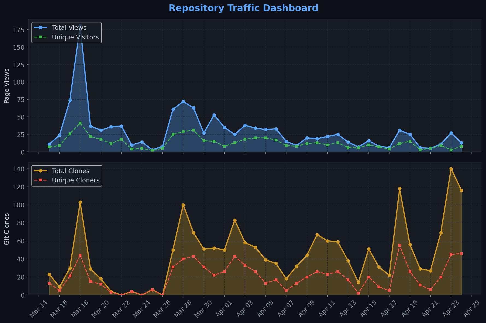
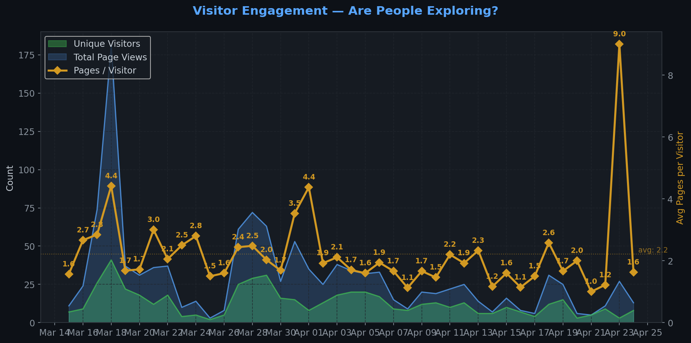
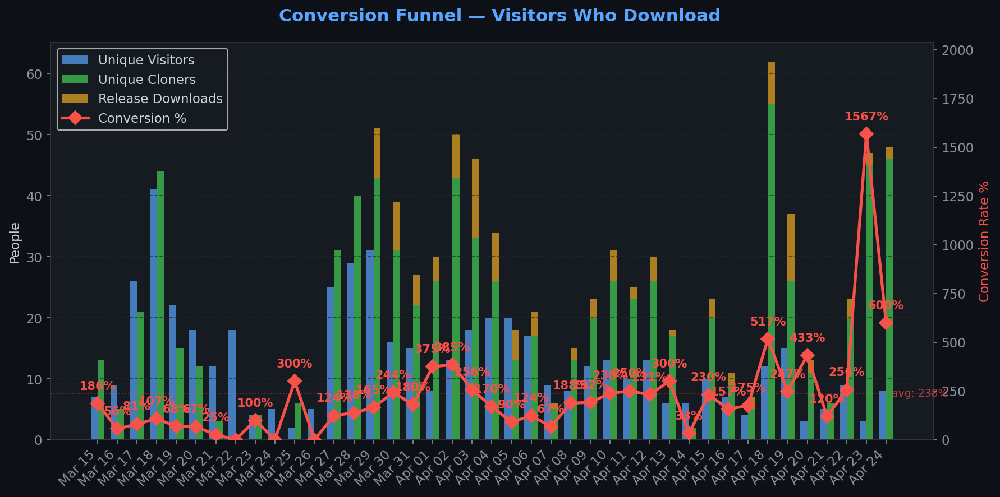
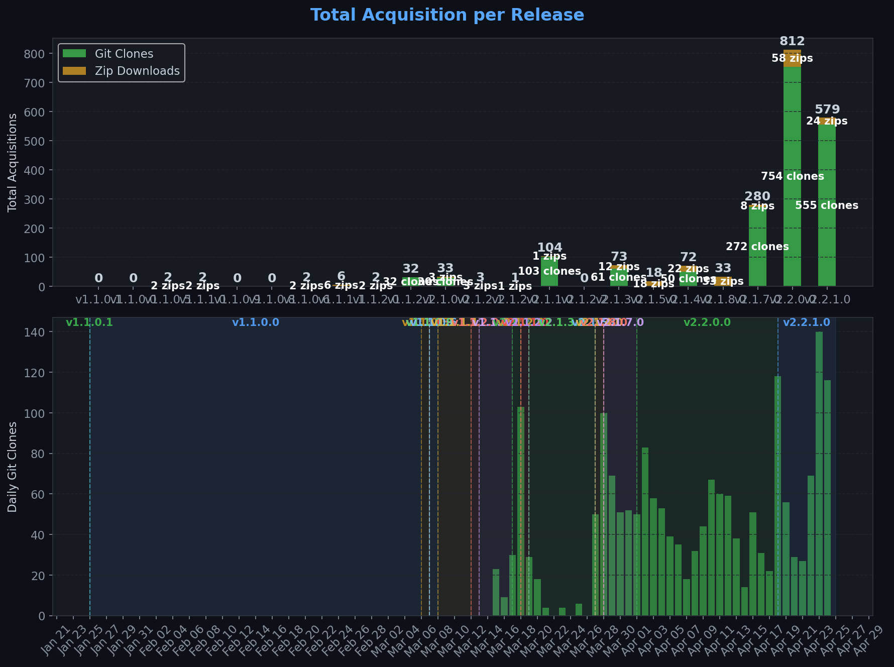
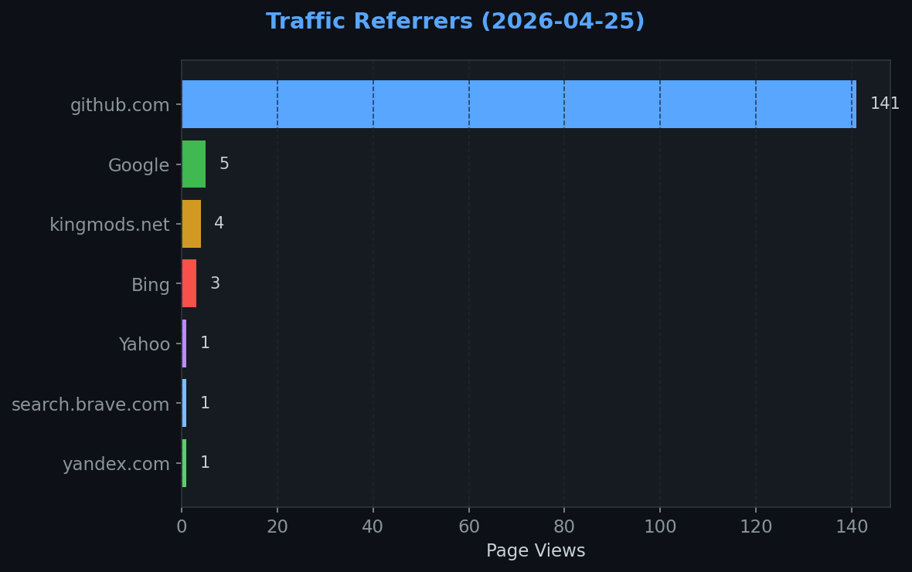
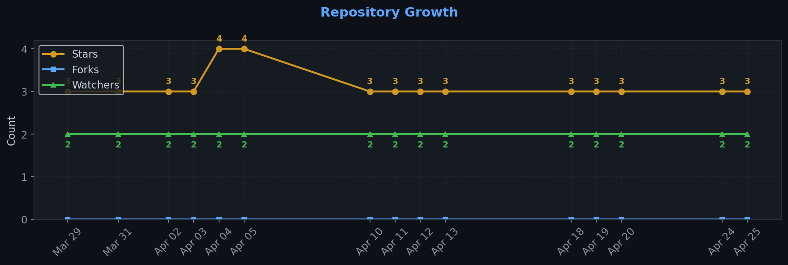

# Repository Traffic Dashboard

**Last updated:** 2026-04-25T18:56:57Z
**Days tracked:** 15 | **Download snapshots:** 103 (hourly)

---

## Views & Clones (14-day window, preserved forever)

| Metric | 14-Day Total | Unique |
|--------|-------------|--------|
| Page Views | 216 | 80 |
| Git Clones | 830 | 272 |

> **Engagement:** 2.7 pages per visitor (14-day avg)

---

## Visitor Engagement

> Higher = visitors exploring more pages. 1.0 = bounce. 3.0+ = deeply engaged.

---

## Conversion Funnel

> **14-day conversion:** 469 of 80 visitors cloned or downloaded (**586.2%**)
>
> Unique cloners: 272 | Release downloads: 197

---

## Total Acquisition per Release (Downloads + Clones)

| Channel | Count |
|---------|-------|
| Zip Downloads | 197 |
| Git Clones (14-day) | 830 |
| **Total Acquisitions** | **1027** |

---

## Referrers

| Source | Views | Unique |
|--------|-------|--------|
| github.com | 141 | 53 |
| Google | 5 | 5 |
| kingmods.net | 4 | 4 |
| Bing | 3 | 2 |
| Yahoo | 1 | 1 |
| search.brave.com | 1 | 1 |
| yandex.com | 1 | 1 |

---

## Repository Growth

| Metric | Current |
|--------|---------|
| Stars | 3 |
| Forks | 0 |
| Watchers | 2 |

---

## Top Pages (14-day)

| Page | Views | Unique |
|------|-------|--------|
| `/TheCodingDad-TisonK/FS25_FarmTablet` | 148 | 72 |
| `/TheCodingDad-TisonK/FS25_FarmTablet/releases/tag/v2.2.1.0` | 19 | 15 |
| `/TheCodingDad-TisonK/FS25_FarmTablet/releases/tag/v2.2.0.0` | 12 | 10 |
| `/TheCodingDad-TisonK/FS25_FarmTablet/releases/tag/v2.1.4.0` | 10 | 8 |
| `/TheCodingDad-TisonK/FS25_FarmTablet/blob/main/docs/general/apps-reference.md` | 7 | 6 |
| `/TheCodingDad-TisonK/FS25_FarmTablet/releases` | 5 | 5 |
| `/TheCodingDad-TisonK/FS25_FarmTablet/blob/main/docs/general/getting-started.md` | 3 | 2 |
| `/TheCodingDad-TisonK/FS25_FarmTablet/blob/main/docs/README.md` | 2 | 1 |
| `/TheCodingDad-TisonK/FS25_FarmTablet/tree/main/docs` | 2 | 1 |
| `/TheCodingDad-TisonK/FS25_FarmTablet/blob/main/docs/general/mod-integrations.md` | 1 | 1 |

---

## Data Files

| File | Description | Granularity |
|------|-------------|-------------|
| [daily.json](daily.json) | Views & clones per day (never expires) | Daily |
| [downloads.json](downloads.json) | Release download snapshots | Hourly |
| [referrers.json](referrers.json) | Referrer snapshots | Daily |
| [metadata.json](metadata.json) | Stars, forks, watchers | Daily |
| [stats.json](stats.json) | Combined legacy snapshots | 6-hourly |

---
*Hourly download tracking + full dashboard with engagement metrics every 6 hours*
*Auto-generated by [traffic-stats.yml](../../.github/workflows/traffic-stats.yml)*
