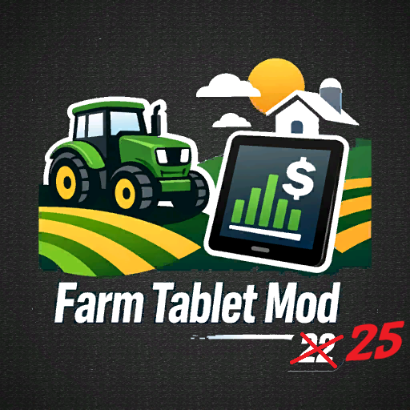

<div align="center">
  




# FS25 Farm Tablet

### *Your entire farm. One key press. Zero menus.*

[](https://github.com/TheCodingDad-TisonK/FS25_FarmTablet/releases)
[](https://github.com/TheCodingDad-TisonK/FS25_FarmTablet/releases/latest)
[](https://creativecommons.org/licenses/by-nc-nd/4.0/)

<br>

> **Tired of pausing the game just to check your balance?**
> **Tired of squinting at vehicle stats buried in sub-menus?**
> **Tired of alt-tabbing to a spreadsheet to track your loads?**
>
> ### Same.

<br>

Press **`T`** — a sleek full-screen tablet slides open.
Check your balance, weather, fields, animals, vehicles, and more.
Press **`T`** again — you're back in the cab. Job done.

<br>

```
 ┌─────────────────────────────────────────────────────────┐
 │  FARM TABLET  v2.1.2.1   │  Green Valley Farm  │ 14:32  │
 ├──────────┬──────────────────────────────────────────────┤
 │  DASH    │  CURRENT BALANCE          $1,284,750          │
 │  WTH     │  ─────────────────────────────────────────── │
 │  FLD     │  Income      $248,300    Net P/L  +$184,200   │
 │  ANI     │  Expenses     $64,100                         │
 │  WRK     │  ─────────────────────────────────────────── │
 │  DIG     │  Active Fields    12      Vehicles   8        │
 │  BCK     │  Season        Spring     Day        47       │
 │  SET     │  Weather    Cloudy  18°C  Wind 12 km/h NW     │
 └──────────┴──────────────────────────────────────────────┘
```

<br>

`Singleplayer` &nbsp;•&nbsp; `Multiplayer` &nbsp;•&nbsp; `15 Apps` &nbsp;•&nbsp; `26 Languages` &nbsp;•&nbsp; `5 Mod Integrations` &nbsp;•&nbsp; `Zero Config`

</div>

   

---

## ⚡ Install in 10 Seconds

```
1.  Download the zip from the Releases page
2.  Drop it into:  Documents\My Games\FarmingSimulator2025\mods\
3.  Load your save
4.  Press  T
```

> No XML editing. No config files. No restart required.
> Settings live inside the tablet itself. Change anything, it saves instantly.

---

## 📱 The Apps

### Core Apps — Always There

| App | What You See |
|-----|-------------|
| 📊 **Dashboard** | Balance hero card · income · expenses · net P&L · active fields · vehicles · season · time · live weather summary |
| 🌤 **Weather** | Full condition card (rain / storm / fog / clear) · temperature feel label · cloud cover · wind speed & direction · humidity · 5-day forecast |
| 🌾 **Field Status** | Every owned field · crop type · growth phase · hectares · colour-coded READY / GROWING / EMPTY badges with totals |
| 🐄 **Animal Husbandry** | All pens · animal count vs capacity · food % · water % · straw/cleanliness bars — green / yellow / red thresholds |
| 🔧 **Workshop** | Vehicles within 35 m · fuel bar · wear bar · operating hours · one-click **REPAIR** button (requires workshop placeable) |
| ⛏ **Digging** | Live player X / Y / Z · controlled vehicle name & speed · attached implements · terrain height · depth below surface — updates every 500 ms |
| 🪣 **Bucket Tracker** | Auto-detects loaders & excavators · counts dump cycles · total estimated tonnage · 20-entry load history with material name & weight · session reset |
| 🛒 **App Store** | All installed apps grouped by category · version · developer · one-click OPEN shortcut |
| ⚙️ **Settings** | Full scrollable config panel — position · scale · sounds · startup app · keybind · notifications · debug mode · **ENTER EDIT MODE** |
| 📋 **Updates** | Full changelog — every version, every fix, newest first |

### Mod Integration Apps — Auto-Detected, Zero Setup

These apps appear in the sidebar **automatically** the moment their companion mod is loaded in your save. No toggles, no config — if the mod is there, the app is there.

| App | Companion Mod | What You Get |
|-----|--------------|-------------|
| 💰 **Income Mod** | [FS25_IncomeMod](https://github.com/TheCodingDad-TisonK/FS25_IncomeMod) | Payment mode · amount per cycle · enabled status · **ENABLE / DISABLE** buttons |
| 📉 **Tax Mod** | [FS25_TaxMod](https://github.com/TheCodingDad-TisonK/FS25_TaxMod) | Tax rate tier · return % · cumulative taxes paid · **ENABLE / DISABLE** buttons |
| 🤝 **NPC Favor** | [FS25_NPCFavor](https://github.com/TheCodingDad-TisonK/FS25_NPCFavor) | Town reputation bar · active favors · per-NPC relationship bars sorted by score |
| 🌱 **Crop Stress** | [FS25_SeasonalCropStress](https://github.com/TheCodingDad-TisonK/FS25_SeasonalCropStress) | Per-field soil moisture % · drought stress indicator · colour-coded moisture bars |
| 🧪 **Soil Fertilizer** | [FS25_SoilFertilizer](https://github.com/TheCodingDad-TisonK/FS25_SoilFertilizer) | N · P · K levels · pH · organic matter · "needs fertilizer" flag · per-field detail view |

---

## 🎮 Controls

| Input | Action |
|-------|--------|
| `T` | Open / close the tablet *(configurable)* |
| **Left click** | Navigate apps · press buttons · select vehicles or fields |
| **Scroll wheel** | Scroll the sidebar (hover over icons) or content area (hover over app panel) |
| **Right-click** | Exit Edit Mode after repositioning |
| `ESC` | Close the tablet |

### Changing the Open Key

Open the tablet → **Settings** — or via console:

```
TabletKeybind F5
```

Supported: any letter (`A`–`Z`), `F1`–`F12`, `TAB`, `SPACE`, `ENTER`, numpad `NUM0`–`NUM9`, arrow keys, and more.

---

## 🖥 Edit Mode — Drag, Resize, Go Wild

Not feeling the default position? **Right-click** the open tablet to enter **Edit Mode**:

```
 ╔═══════════════════════════════════════════════════════════╗
 ║  TABLET EDIT MODE                                         ║
 ║                                                           ║
 ║  Drag body      →  move anywhere on screen                ║
 ║  Drag corners   →  scale the whole tablet (50–200%)       ║
 ║  Drag edges     →  adjust width independently             ║
 ║  Right-click    →  save and exit                          ║
 ╚═══════════════════════════════════════════════════════════╝
```

Position and scale are saved to your savegame automatically. Reset anytime from **Settings → RESET POSITION & SCALE**.

---

## 🖥 Console Commands

Press `` ` `` to open the developer console, then type `tablet` for the full list.

| Command | What It Does |
|---------|-------------|
| `tablet` | Show all available commands |
| `TabletOpen` / `TabletClose` | Force open or close |
| `TabletToggle` | Toggle current state |
| `TabletEnable` / `TabletDisable` | Enable or disable the mod entirely |
| `TabletKeybind [key]` | Change open key — takes effect immediately |
| `TabletApp [id]` | Jump to any app by ID (e.g. `TabletApp weather`) |
| `TabletSetStartupApp [id]` | Set which app opens first |
| `TabletSetNotifications true\|false` | Toggle the HUD welcome message |
| `TabletShowSettings` | Print all current settings |
| `TabletResetSettings` | Reset everything to factory defaults |

**App IDs for `TabletApp` / `TabletSetStartupApp`:**
`dashboard` · `weather` · `field_status` · `animals` · `workshop` · `digging` · `bucket_tracker` · `income_mod` · `tax_mod` · `npc_favor` · `crop_stress` · `soil_fertilizer` · `app_store` · `settings` · `updates`

---

## ⚙️ Settings Reference

All settings are saved to `<savegame>/FS25_FarmTablet.xml` and persist between sessions.

| Setting | Default | Description |
|---------|---------|-------------|
| **Open Key** | `T` | Key that opens and closes the tablet |
| **Startup App** | Dashboard | App shown first on every open |
| **Tablet Position** | Centre | X/Y screen position — set via Edit Mode |
| **Tablet Scale** | 100% | Overall size multiplier (50–200%) |
| **Width Multiplier** | 100% | Independent width stretch (50–200%) |
| **Sound Effects** | On | Master toggle for all tablet sounds |
| **App Select Sound** | On | Click when switching sidebar apps |
| **Help Panel Sound** | On | Paging sound when in-game help opens |
| **Open/Close Sound** | On | Sound when tablet opens or closes |
| **Notifications** | On | Welcome HUD message on save load |
| **Debug Mode** | Off | Verbose logging to `log.txt` |

---

## 🌍 26 Languages

The tablet speaks your language out of the box:

`English` · `German` · `French` · `Spanish` · `Italian` · `Portuguese (BR)` · `Portuguese (PT)` · `Polish` · `Russian` · `Ukrainian` · `Czech` · `Slovak` · `Hungarian` · `Romanian` · `Dutch` · `Swedish` · `Norwegian` · `Danish` · `Finnish` · `Turkish` · `Japanese` · `Korean` · `Chinese (Traditional)` · `Chinese (Simplified)` · `Indonesian` · `Vietnamese`

---

## 🔌 Compatibility

| | |
|---|---|
| **Game** | Farming Simulator 25 |
| **Multiplayer** | ✅ Full support — per-farm data, works on any peer |
| **Dedicated Server** | ✅ Safely skipped — tablet is client-only, no server overhead |
| **Mod Conflicts** | None known — the tablet **reads** game data only, never modifies farm state |
| **Save Safety** | ✅ Settings in a separate XML file, your savegame is never touched |

---

## 🛠 Troubleshooting

**The tablet doesn't open**
→ Confirm the mod is enabled in the mod manager and the savegame was reloaded after installing.
→ Try `TabletEnable` in the developer console.

**A mod integration app isn't showing up**
→ The companion mod must be active in the same savegame. Add it and restart the game session.

**Workshop shows no vehicles**
→ Walk to within 35 m of the vehicle — detection is intentionally local so far-away vehicles don't clutter the list.

**Tablet is off-screen or too large**
→ Open the tablet → **Settings** → **RESET POSITION & SCALE**, or run `TabletResetSettings` in the console.

**Something looks wrong and you want to file a bug**
→ Enable **Debug Mode** in Settings, reproduce the issue, then attach the relevant lines from `log.txt` to your report.

---

## 🤝 Contributing

Bug reports, translation fixes, and feature ideas are all welcome.
See [CONTRIBUTING.md](CONTRIBUTING.md) for guidelines before opening a PR.

Use the issue templates — they make it dramatically faster to investigate:

- 🐛 [Bug Report](https://github.com/TheCodingDad-TisonK/FS25_FarmTablet/issues/new?template=bug_report.yml)
- 💡 [Feature Request](https://github.com/TheCodingDad-TisonK/FS25_FarmTablet/issues/new?template=feature_request.yml)
- 🔗 [Compatibility Report](https://github.com/TheCodingDad-TisonK/FS25_FarmTablet/issues/new?template=compatibility_report.yml)

---

## 📦 The Full Mod Ecosystem

Farm Tablet is the command centre for the **TisonK mod suite**. Install any combination — the tablet picks them all up automatically:

| Mod | What It Adds |
|-----|-------------|
| [FS25_IncomeMod](https://github.com/TheCodingDad-TisonK/FS25_IncomeMod) | Configurable periodic income payments |
| [FS25_TaxMod](https://github.com/TheCodingDad-TisonK/FS25_TaxMod) | Realistic tax deductions with rebate system |
| [FS25_NPCFavor](https://github.com/TheCodingDad-TisonK/FS25_NPCFavor) | NPC relationships and favour mechanics |
| [FS25_SeasonalCropStress](https://github.com/TheCodingDad-TisonK/FS25_SeasonalCropStress) | Soil moisture and drought stress simulation |
| [FS25_SoilFertilizer](https://github.com/TheCodingDad-TisonK/FS25_SoilFertilizer) | Per-field N/P/K nutrient tracking |

---

<div align="center">

**Made with ☕ by [TisonK](https://github.com/TheCodingDad-TisonK)**

[CC BY-NC-ND 4.0](https://creativecommons.org/licenses/by-nc-nd/4.0/) — Free to use, not to redistribute or modify without permission.

*Happy farming. 🚜*

</div>
